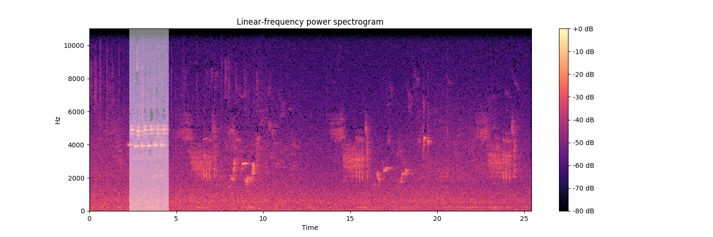

# Audio event detection
Work conducted as an intern at IRCAM. <br/> <br/>
<div align="left">
  <br><br>
</div>

## `pip` installation 
Run the following command :

```
pip install -e git+https://github.com/romainpe/audio-event-detection#egg=evdetect
```

## Example

Detection of a bird's song with a hidden Markov model. <br/>

From the examples directory, run bird.py to get the following output :



This will also output a .wav file in examples/results where the loudness have been increased in
segments matching the event model.<br/>

See [this page](https://romainpe.github.io/audio-event-detection) for more examples.

## References
[1] A. Bietti, online learning for audio clustering and segmentation Master thesis, 2014 <br/><br/>
[2] A. Cont, a coupled duration-focused architecture for realtime music to score alignment, IEEE Transactions on Pattern 
Analysis and Machine Intelligence, 2010 <br/><br/>
[3] Y. Matsubara, Y. Sakurai, N. Ueda and M. Yoshikawa, fast and exact monitoring of co-evolving data streams, IEEE 
International Conference on Data Mining, 2014 <br/><br/>
[4] L. Rabiner, a tutorial on hidden Markov models and selected applications in speech recognition, Proceedings of the 
IEEE, 1989